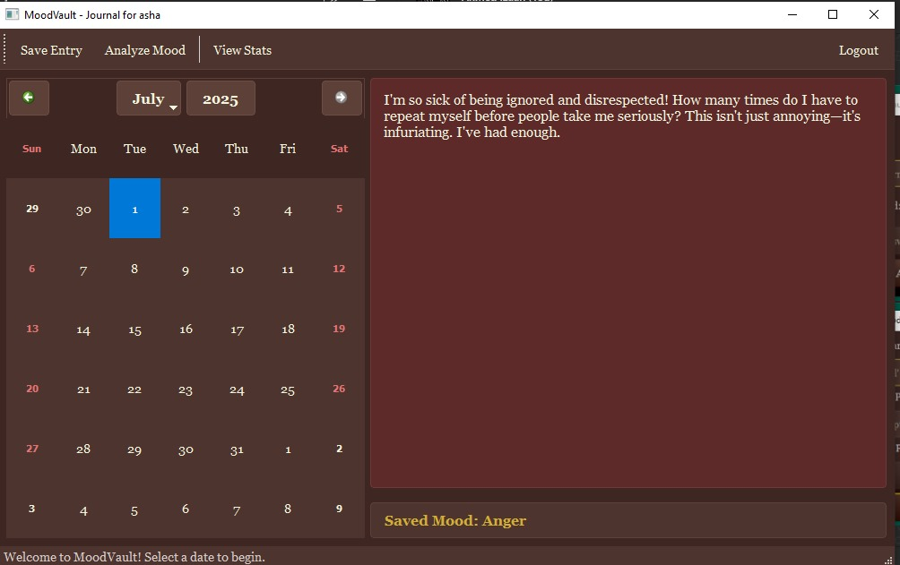
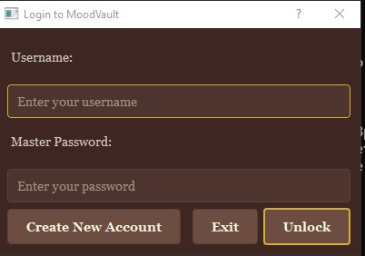
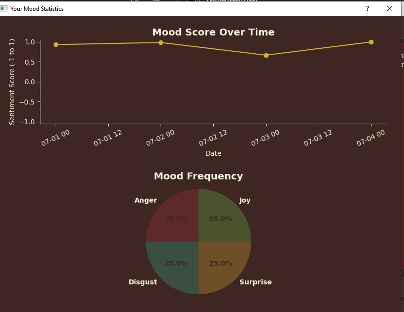

# MoodVault - Your Secure & Intelligent Desktop Journal



**MoodVault is a sophisticated, fully-featured desktop journaling application built with Python.** It provides a private and secure space for users to record their thoughts, with built-in AI-powered emotion analysis to help them track and understand their emotional well-being over time. This project was developed as a showcase of professional software engineering practices, demonstrating a complete application lifecycle from architecture and development to a polished, secure, and distributable final product.

---

## ✨ Key Features

*   **🔒 Secure by Design:**
    *   **User Authentication:** Local-first user account system with industry-standard **bcrypt** password hashing.
    *   **End-to-End Encryption:** All journal entries are encrypted using **AES (via `cryptography.fernet`)** before being saved, ensuring your private thoughts remain completely confidential.

*   **🧠 AI-Powered Emotion Analysis:**
    *   Leverages a state-of-the-art **Hugging Face Transformer model** for nuanced emotion classification.
    *   Identifies 7 distinct emotions (Joy, Sadness, Anger, Fear, Surprise, Disgust, Neutral) to provide deeper insight than simple sentiment polarity.

*   **📊 Insightful Data Visualization:**
    *   Dynamic charts and graphs generated with **Matplotlib** and **Pandas** allow users to visualize their mood history.
    *   Includes a line chart for mood scores over time and a pie chart for overall mood frequency.

*   **✒️ Immersive & Themed GUI:**
    *   A beautiful and intuitive user interface built with **PyQt5**.
    *   Features a custom dark-brown, vintage-style theme for a unique and pleasant user experience, with the editor color dynamically changing to reflect the current mood.

*   **📦 Portable & Standalone:**
    *   Uses an embedded **SQLite** database, requiring no external database servers or configuration.
    *   Packaged into a single, distributable executable using **PyInstaller**, allowing anyone to run it without installing Python or any dependencies.

---

## 🚀 Getting Started

You can run MoodVault in two ways: by downloading the pre-built application or by running it from the source code.

### Option 1: Download the Latest Release (Recommended)

1.  Go to the [**Releases Page**](https://github.com/AhmedIzaan/moodvault/releases) of this repository.
2.  Download the `.zip` file for the latest version (e.g., `MoodVault_v1.0-Windows.zip`).
3.  Unzip the file.
4.  Double-click `MoodVault.exe` to run the application. No installation is needed!

### Option 2: Running from Source

If you are a developer and want to run the project from its source code:

1.  **Clone the repository:**
    ```bash
    git clone https://github.com/AhmedIzaan/moodvault.git
    cd moodvault
    ```

2.  **Create a virtual environment (recommended):**
    ```bash
    python -m venv venv
    source venv/bin/activate  # On Windows, use `venv\Scripts\activate`
    ```

3.  **Install the dependencies:**
    ```bash
    pip install -r requirements.txt
    ```

4.  **Run the application:**
    ```bash
    python main.py
    ```

---

## 🖼️ Screenshots

| Login Screen                                       | Statistics & Graphs                                    |
| -------------------------------------------------- | ------------------------------------------------------ |
|  |  |

<br/>

*The diary editor dynamically changes color to match the analyzed mood of the text, creating an immersive writing experience.*

---

## 🛠️ Technology Stack

This project utilizes a wide range of modern Python technologies:

*   **GUI:** PyQt5
*   **Database:** SQLite3
*   **AI / NLP:** Hugging Face `transformers` (with PyTorch backend)
*   **Data Analysis & Visualization:** Pandas, Matplotlib
*   **Cryptography:** `cryptography` (for AES encryption)
*   **Authentication:** `bcrypt` (for password hashing)
*   **Packaging:** PyInstaller

---

This project was built as a portfolio piece to demonstrate skills in desktop application development, data security, applied AI, and software architecture.